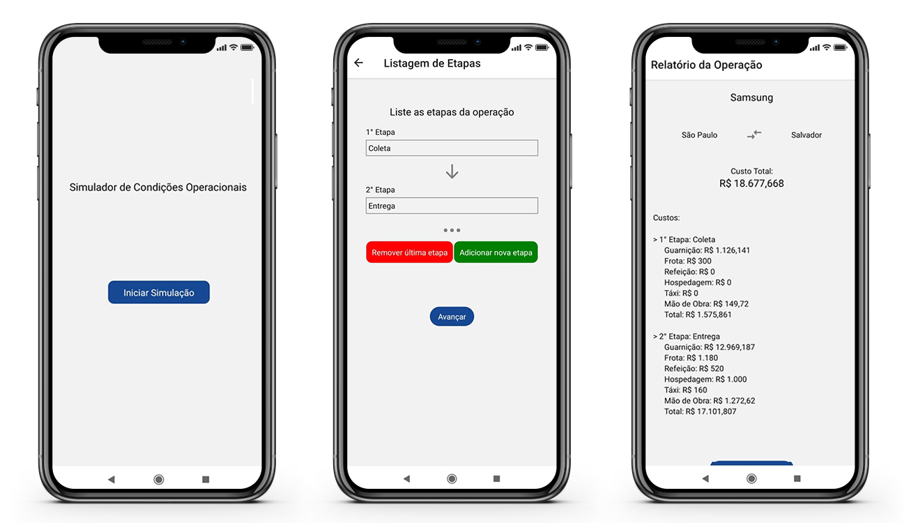

# 🚚 SCO - Simulador de Condições Operacionais
 Aplicativo que gera um orçamento de uma operação logística.
 
<h1 align="center">
    
</h1>

## 💡 Ideia
 A ideia do aplicativo surgiu a partir de uma conversa com uma pessoa próxima que relatou uma necessidade na empresa que trabalha, a necessidade de gerar um orçamento de uma operação logistica em campo, sem ter que acessar a planilha Excel em um computador.
 
 ## 💻 Objetivo da aplicação
Obter um orçamento de uma operação logística. A aplicação recebe os custos unitários de uma operação como, custo com gasolina e mão de obra, e retorna um valor total estimado do custo total da operação.

## :rocket: Tecnologias
- [React Native](https://facebook.github.io/react-native/)
- [Expo](https://expo.io/)
